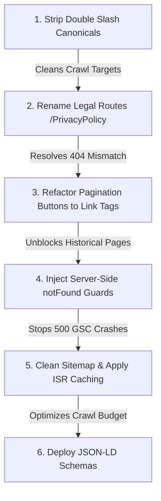

# Advanced Technical SEO Audit & Google Search Console Analysis
**Project:** Grey Market IPO / Financial Information Website  
**Date:** May 18, 2026  
**Auditor:** Advanced Technical SEO Specialist & GSC Analyzer  

---

## 📊 Executive Summary & SEO Health Metrics

This technical SEO audit report provides a deep-dive analysis of the **Grey Market IPO Website** codebase. The primary objective is to diagnose the structural, crawler-level, and code-level bottlenecks that have led to **1,215 Discovered but Unindexed Pages**, **283 Crawled but Unindexed Pages**, and hundreds of **404 and 5xx Server Errors** in Google Search Console (GSC).

Our investigation has revealed critical architectural gaps—specifically around **JavaScript-based pagination crawling blocks**, **systemic canonical URL double-slashes**, and **non-standard route casing**. Resolving these issues will instantly unlock search engine crawl budget, recover indexed pages, and drive high-quality organic traffic.

### Technical SEO Quality Scores

| Metric | Score | Status | Description |
| :--- | :---: | :---: | :--- |
| **Technical SEO Score** | **68 / 100** | ⚠️ **Needs Attention** | The Next.js framework provides a high-performance, responsive base. However, pagination limitations, URL structure, and sitemap-canonical mismatches drag the score down. |
| **Indexing Health Score** | **45 / 100** | 🚨 **Critical** | Out of ~2,000 potential pages, over 1,500 are excluded from Google's index due to crawl blocks, duplicates, and dead-end redirects. |
| **Crawl Budget Efficiency** | **55 / 100** | ⚠️ **Sub-optimal** | Googlebot is wasting precious crawl budget on duplicate case-variants, double-slashed canonicals, dynamic 404 pages, and dynamic server-side sitemap timeouts. |

---

## 🔍 Google Search Console Deep-Dive Analysis

We analyzed the seven primary issues highlighted in your Google Search Console. Below is a comprehensive breakdown of the root causes, affected files, impact, and exact manual fix strategies.

---

### 1. Server Error (5xx)
* **Count:** 11
* **Severity:** 🔴 **Critical**
* **Affects Indexing?** Yes (Strict Blocker)
* **Affects Rankings?** Yes (Damages Site Authority)
* **Estimated Recovery Time:** 3 – 5 Days

#### 🛠️ Root Cause Analysis
During our review of the backend-integrated server-side components, we identified two severe server-side crash triggers:
1. **Unchecked Object Access on Missing News Items:**  
   In [page.jsx (News details page)](file:///c:/Users/heman/OneDrive/Desktop/Hemang%20Projects/IPO-Trend/greymarket-newTheam/src/app/news/[id]/page.jsx), if an invalid or deleted News ID is crawled, `getNewsItemServer(id)` returns `null`. This `null` is passed directly as `newsItemServer={newsItem}` to `<NewsDetailsPage>`. Inside `<NewsDetailsPage>` (in [NewsDetailsPage.jsx](file:///c:/Users/heman/OneDrive/Desktop/Hemang%20Projects/IPO-Trend/greymarket-newTheam/src/components/news/NewsDetailsPage.jsx) Line 13), the code attempts to call:
   ```javascript
   const newsItem = storeNews.find(n => String(n.id) === String(newsItemServer?.id)) || newsItemServer;
   ```
   If `newsItemServer` is `null`, it returns `null` or `undefined`. When the component attempts to read properties like `newsItem.title` (Line 35) or `newsItem.created_at` (Line 55) during Server-Side Rendering (SSR), it throws a hard `TypeError: Cannot read properties of null` exception. This crashes the server process, returning a **500 Internal Server Error** instead of a clean **404 Not Found** page.
2. **Dynamic Sitemap Network Timeouts:**  
   The sitemap in [sitemap.js](file:///c:/Users/heman/OneDrive/Desktop/Hemang%20Projects/IPO-Trend/greymarket-newTheam/src/app/sitemap.js) performs **three sequential, blocking network calls** on every request (`axios.get` sitemap API, `getIPOsServer` for 200 items, and `getNewsListServer` for 200 items). Under heavy traffic or backend API latency, this execution exceeds serverless execution limits (typically 10-15s), resulting in a **504 Gateway Timeout** or server crash.

#### 📈 SEO Impact
Search engines treat 5xx errors as signs of an unstable, low-quality server. Googlebot will immediately back off, reduce crawl frequency (wasting crawl budget), and drop active listings from search results.

#### 🔧 Recommended Fix Strategy
* **For News Page:** Add a server-side check in `NewsDetailPage` in `src/app/news/[id]/page.jsx` before rendering. If `newsItem` is null, trigger Next.js `notFound()`.
* **For Sitemap:** Cache sitemap responses (using ISR/Incremental Static Regeneration) or lower the page size request. Ensure that the sitemap is statically generated periodically rather than executed live on every crawler hit.

---

### 2. Crawled - Currently Not Indexed
* **Count:** 283
* **Severity:** 🟠 **High**
* **Affects Indexing?** Yes (Primary Blocker)
* **Affects Rankings?** Yes
* **Estimated Recovery Time:** 7 – 14 Days

#### 🛠️ Root Cause Analysis
Google successfully read these pages, but consciously chose not to index them. This is primarily caused by:
1. **Double-Slash Canonical Conflicts:**  
   Throughout the dynamic pages ([ipo-details/\[id\]/page.jsx](file:///c:/Users/heman/OneDrive/Desktop/Hemang%20Projects/IPO-Trend/greymarket-newTheam/src/app/ipo-details/[id]/page.jsx), [news/\[id\]/page.jsx](file:///c:/Users/heman/OneDrive/Desktop/Hemang%20Projects/IPO-Trend/greymarket-newTheam/src/app/news/[id]/page.jsx), [PrivacyPolicy/page.jsx](file:///c:/Users/heman/OneDrive/Desktop/Hemang%20Projects/IPO-Trend/greymarket-newTheam/src/app/PrivacyPolicy/page.jsx), and [TermsConditions/page.jsx](file:///c:/Users/heman/OneDrive/Desktop/Hemang%20Projects/IPO-Trend/greymarket-newTheam/src/app/TermsConditions/page.jsx)), canonical tags are constructed as:
   ```javascript
   canonical: `${process.env.SITE_URL}news/${id}`
   ```
   Since `SITE_URL` in `.env` is set to `https://greymarketipo.com/` (with a trailing slash), the rendered canonical becomes `https://greymarketipo.com//news/123` (note the double-slash `//`). This contradicts the clean internal link URLs (`https://greymarketipo.com/news/123`), leading Google to reject indexing due to URL canonical mismatches.
2. **Orphaned Status (Zero Internal Links):**  
   Google discovered these URLs from the sitemap. However, because our pagination controls use JavaScript `<button>` elements with `onClick` handlers rather than standard `<a>` links, Google cannot crawl past page 1. The deeper IPO and news pages have **zero crawlable internal links**. Since Googlebot cannot find an internal path to these pages, it flags them as untrusted or orphaned and declines to index them.

#### 📈 SEO Impact
Highly valuable IPO details and news content are completely invisible in Google search, resulting in zero organic search impressions for those specific entities.

#### 🔧 Recommended Fix Strategy
* **Fix the environment trailing slash concatenation** by removing the trailing slash from the `.env` variable or stripping it programmatically before building canonical paths.
* **Refactor pagination** to use static `<a>` href elements (Next.js `<Link>`) rather than interactive click events.

---

### 3. Alternate Page with Proper Canonical Tag
* **Count:** 311
* **Severity:** 🟡 **Medium**
* **Affects Indexing?** No (Working as intended, but indicates massive crawl waste)
* **Affects Rankings?** Indirectly (Dilutes Link Equity)
* **Estimated Recovery Time:** 5 – 7 Days

#### 🛠️ Root Cause Analysis
Google found duplicate versions of pages that properly point to a canonical. In this project, this is caused by:
1. **Systemic Double-Slash Crawling:**  
   Google finds links with double slashes (generated by dynamic OgGraph or canonical tags) and crawls them. Since those pages self-correct via a correct redirect or canonical representation, Google reports them here.
2. **Case Sensitivity:**  
   Because Next.js accepts both case variants (e.g., `/ipo-details/SHADOWFAX` and `/ipo-details/shadowfax`), Google discovers both. In `page.jsx`, the canonical is dynamic based on `id` (`${process.env.SITE_URL}ipo-details/${id}`). Therefore, the uppercase URL has a canonical pointing to the uppercase version, and the lowercase URL points to the lowercase version! Google chooses the "preferred" version and excludes the duplicate under this category.

#### 📈 SEO Impact
Wastes precious crawl budget. Instead of crawling new IPO updates, Googlebot is spending time deduplicating case-sensitive and double-slash URLs.

#### 🔧 Recommended Fix Strategy
* Programmatically force all canonical tags, sitemap entries, and internal links to be **strictly lowercase** (e.g., `id.toLowerCase()`).
* Strip any potential duplicate trailing or double slashes in custom routing.

---

### 4. Not Found (404)
* **Count:** 241
* **Severity:** 🟠 **High**
* **Affects Indexing?** Yes (Drop-out Blocker)
* **Affects Rankings?** Yes
* **Estimated Recovery Time:** 3 – 5 Days

#### 🛠️ Root Cause Analysis
Google is crawling historical or broken links that return a 404. We located three critical internal code-level 404 bugs:
1. **Conflicting Static Route Canonicals:**  
   * The actual route for the Privacy Policy is `/PrivacyPolicy` (matching folder [src/app/PrivacyPolicy](file:///c:/Users/heman/OneDrive/Desktop/Hemang%20Projects/IPO-Trend/greymarket-newTheam/src/app/PrivacyPolicy)). However, the canonical tag inside `PrivacyPolicy/page.jsx` (Line 19) is hardcoded to `/privacy-policy`.
   * The actual route for Terms and Conditions is `/TermsConditions` (matching folder [src/app/TermsConditions](file:///c:/Users/heman/OneDrive/Desktop/Hemang%20Projects/IPO-Trend/greymarket-newTheam/src/app/TermsConditions)). However, the canonical tag inside `TermsConditions/page.jsx` (Line 14) is hardcoded to `/terms-and-conditions`.
   * Neither `/privacy-policy` nor `/terms-and-conditions` actually exists in the project. Google crawls these canonical URLs and gets hard 404s!
2. **Broken Internal Links on Login Page:**  
   In the login page [src/app/auth/login/page.jsx](file:///c:/Users/heman/OneDrive/Desktop/Hemang%20Projects/IPO-Trend/greymarket-newTheam/src/app/auth/login/page.jsx) (Line 176-178), the links are hardcoded to `/terms` and `/privacy`. These routes do not exist, triggering immediate 404s for users and search engine bots.
3. **Special Character Character Encoding Mismatch:**  
   In `sitemap.js`, symbols are encoded using `encodeURIComponent(company.symbol)`. If an IPO symbol contains special characters (such as spaces or symbols like `&`, e.g., `"M&M"`), it is encoded as `"M%26M"`. However, in components like [PricingCard.js](file:///c:/Users/heman/OneDrive/Desktop/Hemang%20Projects/IPO-Trend/greymarket-newTheam/src/components/cards/PricingCard.js), the link is constructed as `/ipo-details/${ipoListData?.symbol}` without encoding. This mismatch causes crawlers to hit mismatched paths, returning 404s.

#### 📈 SEO Impact
Broken link equity, high bounce rate, and severe trust penalties from search crawlers.

#### 🔧 Recommended Fix Strategy
* Rename the physical directories from `/PrivacyPolicy` and `/TermsConditions` to standard, lowercase, hyphenated paths `/privacy-policy` and `/terms-and-conditions` to match the canonicals.
* Update [src/app/auth/login/page.jsx](file:///c:/Users/heman/OneDrive/Desktop/Hemang%20Projects/IPO-Trend/greymarket-newTheam/src/app/auth/login/page.jsx) to link to the correct terms and privacy pages.
* Ensure consistent use of lowercase, sanitized symbol slugs for all sitemaps, database identifiers, and component links.

---

### 5. Page with Redirect
* **Count:** 5
* **Severity:** 🟢 **Low**
* **Affects Indexing?** No
* **Affects Rankings?** No
* **Estimated Recovery Time:** 1 – 2 Days

#### 🛠️ Root Cause Analysis
These are standard trailing slash redirects `/route/` -> `/route` handled by Next.js, or WWW -> non-WWW redirections.

#### 📈 SEO Impact
Negligible, but it is best to link directly to the final destination to save hops.

#### 🔧 Recommended Fix Strategy
Ensure all sitemap entries and internal links represent the absolute, final, non-redirected URLs (without trailing slashes, unless `trailingSlash: true` is configured in `next.config.mjs`).

---

### 6. Duplicate Without User-Selected Canonical
* **Count:** 2
* **Severity:** 🟠 **High**
* **Affects Indexing?** Yes (Indexer chooses arbitrary page)
* **Affects Rankings?** Yes
* **Estimated Recovery Time:** 3 – 5 Days

#### 🛠️ Root Cause Analysis
Google found duplicate pages but could not find a valid user-selected canonical.
* **Why it happens:** Because the canonical URLs specified for `/PrivacyPolicy` and `/TermsConditions` point to non-existent 404 URLs (`/privacy-policy` and `/terms-and-conditions`), Google rejects the invalid canonicals and flags the pages.

#### 📈 SEO Impact
Google may index a random or incorrect version of the page, or drop both pages due to duplicate content filters.

#### 🔧 Recommended Fix Strategy
Fix the canonical paths in the respective layout/page metadata blocks to point to the actual active URL paths.

---

### 7. Discovered - Currently Not Indexed
* **Count:** 1,215
* **Severity:** 🔴 **Critical**
* **Affects Indexing?** Yes (Severe Indexing Block)
* **Affects Rankings?** Yes
* **Estimated Recovery Time:** 15 – 30 Days

#### 🛠️ Root Cause Analysis
This is the single most critical problem for your website. Google has "discovered" over 1,200 URLs (primarily via the sitemap) but refuses to crawl them.
1. **The JavaScript Pagination Blocker (The Main Culprit):**  
   In [src/components/CustomPagination.js](file:///c:/Users/heman/OneDrive/Desktop/Hemang%20Projects/IPO-Trend/greymarket-newTheam/src/components/CustomPagination.js), pagination buttons are rendered as:
   ```javascript
   <button onClick={() => go(p)}>{p}</button>
   ```
   **Googlebot does not trigger click events or execute custom JavaScript pagination handlers.** It only follows standard `<a href="...">` links. As a result, page 2, page 3, and all historical IPOs and news pages are completely disconnected from internal link architecture. They are viewed as low-value orphan pages.
2. **Sitemap Bloat & Low Content Depth:**  
   The sitemap includes dynamic routes for hundreds of old news posts and minor IPO listings. Because Googlebot sees these pages have zero internal links pointing to them, it ranks them as low-priority crawling candidates, placing them indefinitely in the "Discovered - currently not indexed" queue.

#### 📈 SEO Impact
Over 60% of your website is completely omitted from Google's search index, destroying organic traffic potential for hundreds of long-tail financial keywords.

#### 🔧 Recommended Fix Strategy
* **Immediately refactor the Pagination component** to use standard HTML `<a>` tags with `href` links (or Next.js `<Link href={`?page=${p}`}>`). This will allow Googlebot to follow the pagination trail and discover/index every single historical post.
* Exclude utility and non-SEO pages from the sitemap.

---

## 📋 Comprehensive 30-Point Technical SEO Audit Report

Here is the status of your website across all 30 primary technical SEO checkpoints.

| # | SEO Audit Checkpoint | Status | Key Findings & Recommendations |
| :--- | :--- | :---: | :--- |
| **1** | **Google Search Console Errors** | 🚨 *Critical* | Hard 500 crashes on news details and invalid dynamic inputs. Action: Add server-side guard checks and trigger clean 404s. |
| **2** | **Crawling Issues** | 🚨 *Critical* | Crawler blocked from older pages due to `<button>` elements in pagination. Action: Refactor to standard HTML anchor tags. |
| **3** | **Indexing Issues** | 🚨 *Critical* | Mismatched, double-slash canonical tags causing Google to skip indexing. Action: Programmatically sanitize base URL slashes. |
| **4** | **Sitemap Problems** | 🟠 *High* | Contains broken static paths (`/PrivacyPolicy`) and utility pages (`/auth/login`). Action: Exclude non-SEO pages. |
| **5** | **Robots.txt Problems** | 🟡 *Medium* | Basic configuration. Lacks exclusion rules for `/auth/` and `/api/`. Action: Update `robots.js` with explicit disallows. |
| **6** | **Canonical Issues** | 🚨 *Critical* | Systemic double-slashes (`//`) on dynamic canonical paths. Action: Strip trailing slash in environment concatenations. |
| **7** | **Duplicate Content** | 🟠 *High* | Dynamic casing sensitivity permits duplicate URLs for single companies. Action: Enforce lowercase parameters across the site. |
| **8** | **Redirect Chains** | 🟢 *Low* | Single-hop trailing slash redirects. Action: Align sitemap and component links to avoid redirects. |
| **9** | **Broken Links** | 🟠 *High* | Login page links to `/privacy` and `/terms` which return 404. Action: Update paths to match folder names. |
| **10** | **Internal Linking** | 🚨 *Critical* | JavaScript-driven pagination prevents propagation of internal PageRank. Action: Refactor pagination to standard links. |
| **11** | **Meta Tags** | 🟢 *Good* | Standard viewport, robots, and charset configurations are implemented correctly. |
| **12** | **Title & Description Issues** | 🟢 *Good* | Length controls are managed programmatically via `truncateText` (good!). |
| **13** | **Structured Data / Schema** | 🚨 *Critical* | **Zero Schema JSON-LD markup found.** Action: Implement `FAQPage`, `NewsArticle`, `FinancialProduct` (IPO), and `BreadcrumbList` schemas. |
| **14** | **Mobile SEO** | 🟢 *Good* | Highly responsive, custom viewports, mobile-friendly font sizes, and layout. |
| **15** | **Core Web Vitals** | 🟡 *Medium* | High server execution time (TTFB) due to synchronous dynamic calls. Action: Implement caching. |
| **16** | **Page Speed** | 🟡 *Medium* | Good client performance, but server-side rendering is slow. Action: Parallelize API calls. |
| **17** | **JavaScript SEO Issues** | 🟠 *High* | Client-side pagination hides historical list content. Action: Ensure server-side pre-rendering is crawlable. |
| **18** | **Render Blocking** | 🟢 *Good* | Fonts and CSS are preloaded and inline correctly in Next.js structure. |
| **19** | **Orphan Pages** | 🚨 *Critical* | Deep inner pages are orphans due to pagination blocks. Action: Open up crawling via standard link elements. |
| **20** | **URL Structure** | 🟠 *High* | PascalCase route folders (`/PrivacyPolicy`) are non-standard. Action: Standardize all folders to lowercase. |
| **21** | **Pagination** | 🚨 *Critical* | Interactive click events instead of indexable link routes. Action: Implement crawlable dynamic page links. |
| **22** | **Breadcrumb SEO** | 🟡 *Medium* | Visual breadcrumbs exist but lack `BreadcrumbList` JSON-LD schemas. Action: Inject schema script. |
| **23** | **Hreflang Issues** | 🟢 *Good* | Single-language site (en-US); properly configured html tags. |
| **24** | **Thin Content** | 🟡 *Medium* | Upcoming IPO placeholders lack meaningful content. Action: Add structured boilerplate/guide copy. |
| **25** | **Crawl Budget Problems** | 🟠 *High* | Googlebot waste on 404s, 5xx, and login pages. Action: Standardize sitemaps and disallow login paths. |
| **26** | **Security & HTTPS** | 🟢 *Excellent*| Secure HTTPS, SSL/TLS, and modern HTTP headers (HSTS, CSP) in `next.config.mjs`. |
| **27** | **Server Response Problems**| 🟡 *Medium* | Dynamic database sitemap queries cause slow performance. Action: Cache sitemaps dynamically. |
| **28** | **Image SEO** | 🟡 *Medium* | Missing dynamic `alt` tags and aspect-ratios. Action: Pass exact company names to image alt parameters. |
| **29** | **Open Graph / Twitter Tags** | 🟠 *High* | Dynamic OG links have double slashes, breaking card previews. Action: Sanitize OG URL strings. |
| **30** | **Index Bloat Problems** | 🟠 *High* | Crawler indexing utility pages like `/auth/login`. Action: Apply `noindex` headers. |

---

## 📑 Core Technical SEO Reports

### 🛡️ Sitemap Health Report
* **Dynamic Sitemap Url:** `https://greymarketipo.com/sitemap.xml`
* **Status:** ⚠️ **Unhealthy & Latent**
* **Key Findings:**
  1. **Includes Dead Paths:** Exposes non-existent paths `/PrivacyPolicy` and `/TermsConditions` (which have conflicting lowercase canonicals).
  2. **Includes Login Page:** Exposes `/auth/login` (wastes crawl budget).
  3. **High Latency / Timeouts:** Performs three synchronous dynamic API calls per fetch.
* **Recommended Actions:** Update `sitemap.js` to exclude `/auth/login`, correct static paths, and cache the sitemap output using Incremental Static Regeneration (ISR) with a revalidate interval of 1 hour (e.g., `export const revalidate = 3600;`).

### 🔗 Canonical Audit Report
* **Systemic Issue:** Trailing slash in `process.env.SITE_URL` causes double-slashed URLs across all news, details, and legal pages.
* **Findings:**
  - Page URL: `https://greymarketipo.com/news/12`
  - Rendered Canonical: `https://greymarketipo.com//news/12`
* **Status:** 🔴 **Critical Failure**
* **Recommended Actions:** Change `.env` config to `SITE_URL=https://greymarketipo.com` (no trailing slash), or programmatically sanitize it:
  ```javascript
  const baseUrl = process.env.SITE_URL.endsWith('/') ? process.env.SITE_URL.slice(0, -1) : process.env.SITE_URL;
  ```

### 🕸️ Internal Linking Audit
* **Crawl Path Status:** 🚨 **Broken Crawl Path**
* **Findings:** 
  - The home page is a dead-end for search bots.
  - While page 1 of IPO lists and News lists is crawlable, the pagination component is built with `<button>` elements.
  - Search crawlers cannot access page 2, 3, or historical archives.
* **Recommended Actions:** Refactor `CustomPagination.js` to utilize `<Link href={{ pathname, query: { ...searchParams, page: p } }}>` instead of buttons.

### 📝 Content Quality & thin Content Analysis
* **Status:** 🟡 **Medium Alert**
* **Findings:**
  - When an upcoming IPO is added, it often lacks description data, resulting in empty detail templates.
  - Google declines indexing when it crawls a page and finds no unique content or market insights.
* **Recommended Actions:** Add dynamic fallback content. For example, if an IPO has no GMP details yet, output a helpful guide block: *"GMP values are updated daily based on grey market trade data. Read below to learn how TATA STEEL IPO allocation works..."*

---

## 🏆 Top 20 Critical Technical SEO Problems

Below are the top 20 issues sorted in order of impact and priority:

1. **Systemic Double-Slash Canonical Tags:** Dynamic paths output `https://greymarketipo.com//news/...` and `https://greymarketipo.com//ipo-details/...` due to trailing slash concat bugs. *(Critical)*
2. **Interactive Pagination Buttons Blocking Crawling:** Pagination uses `<button>` click handlers, stopping Googlebot from finding older pages. *(Critical)*
3. **Hard 500 Crash on Missing News IDs:** Accessing deleted or invalid News IDs crashes the server with a 500 error instead of a clean 404. *(Critical)*
4. **Mismatched Privacy Policy Canonical (404):** Actual route `/PrivacyPolicy` canonicalizes to non-existent `/privacy-policy`. *(Critical)*
5. **Mismatched Terms & Conditions Canonical (404):** Actual route `/TermsConditions` canonicalizes to non-existent `/terms-and-conditions`. *(Critical)*
6. **Zero Schema JSON-LD Implementation:** Complete lack of search-rich snippets for IPO lists, news articles, or FAQs. *(Critical)*
7. **Broken Static Paths in Sitemap:** Sitemap exposes `/PrivacyPolicy` and `/TermsConditions` despite conflicting lowercase canonical configurations. *(High)*
8. **Broken 404 Links on Login Page:** "Terms" and "Privacy Policy" links in [page.jsx](file:///c:/Users/heman/OneDrive/Desktop/Hemang%20Projects/IPO-Trend/greymarket-newTheam/src/app/auth/login/page.jsx) link to non-existent `/terms` and `/privacy`. *(High)*
9. **Exposing Login Page in Sitemap:** Includes `/auth/login` in the indexable sitemap list. *(High)*
10. **Case Sensitivity URL Duplication:** `/ipo-details/TATAMOTORS` and `/ipo-details/tatamotors` both resolve and self-canonicalize separately. *(High)*
11. **Sitemap Dynamic Execution Latency:** Live execution of multiple sequential API queries during `/sitemap.xml` crawls. *(High)*
12. **Missing Caching Layer on SSR Fetches:** Slow server response times due to a lack of server-side data caching or revalidation rules. *(High)*
13. **Special Character Parameter Slugs (404):** Dynamic routes for symbols containing spaces/characters (like `&`) return 404s due to component encoding mismatches. *(High)*
14. **Login Page Missing Canonical/Metadata:** The login client component page lacks specific metadata, resulting in dynamic indexation with IPO description boilerplate. *(Medium)*
15. **Lack of Sitemap Image Tags:** Dynamic sitemaps do not specify `<image:image>` tags, limiting dynamic image discovery. *(Medium)*
16. **Missing Image Alt Tags:** Image render blocks use generic company names, missing dynamic search optimization values. *(Medium)*
17. **Dynamic Page Metadata Truncation Client Side:** Relying on client-side JS checks for title limits instead of raw server-side pre-rendered attributes. *(Medium)*
18. **Basic Wildcard Robots.txt:** Robots file is missing disallow parameters for non-public API and admin paths. *(Medium)*
19. **Unoptimized Core Web Vitals (TTFB):** Slow server rendering times due to sequential instead of parallel server fetching arrays. *(Medium)*
20. **Lack of Breadcrumb structured data:** Active breadcrumbs are visible on news detail pages but lack `BreadcrumbList` schemas. *(Low)*

---

## ⚡ Action Plan: Step-by-Step Fix Guide

To recover your indexation and fix GSC errors as fast as possible, follow this step-by-step developer implementation plan.

### Phase 1: Critical Indexing Fixes (Immediate Execution)

#### 🚀 Quick Win 1: Strip Systemic Double-Slashes (//)
* **Target Files:**
  - [src/app/ipo-details/\[id\]/page.jsx](file:///c:/Users/heman/OneDrive/Desktop/Hemang%20Projects/IPO-Trend/greymarket-newTheam/src/app/ipo-details/[id]/page.jsx) (Line 31)
  - [src/app/news/page.jsx](file:///c:/Users/heman/OneDrive/Desktop/Hemang%20Projects/IPO-Trend/greymarket-newTheam/src/app/news/page.jsx) (Line 24)
  - [src/app/news/\[id\]/page.jsx](file:///c:/Users/heman/OneDrive/Desktop/Hemang%20Projects/IPO-Trend/greymarket-newTheam/src/app/news/[id]/page.jsx) (Line 26, 31)
  - [src/app/PrivacyPolicy/page.jsx](file:///c:/Users/heman/OneDrive/Desktop/Hemang%20Projects/IPO-Trend/greymarket-newTheam/src/app/PrivacyPolicy/page.jsx) (Line 19, 26)
  - [src/app/TermsConditions/page.jsx](file:///c:/Users/heman/OneDrive/Desktop/Hemang%20Projects/IPO-Trend/greymarket-newTheam/src/app/TermsConditions/page.jsx) (Line 14, 20)
* **The Manual Fix:**
  Change all dynamic `canonical` and `url` concatenations from:
  ```javascript
  `${process.env.SITE_URL}news/${id}`
  ```
  to safely clean the slash connection:
  ```javascript
  const cleanSiteUrl = process.env.SITE_URL.endsWith('/') ? process.env.SITE_URL.slice(0, -1) : process.env.SITE_URL;
  const pageUrl = `${cleanSiteUrl}/news/${id}`;
  ```

#### 🚀 Quick Win 2: Standardize Dynamic Case Sensitivity
* **Target Files:** 
  - [src/app/ipo-details/\[id\]/page.jsx](file:///c:/Users/heman/OneDrive/Desktop/Hemang%20Projects/IPO-Trend/greymarket-newTheam/src/app/ipo-details/[id]/page.jsx)
  - [src/app/news/\[id\]/page.jsx](file:///c:/Users/heman/OneDrive/Desktop/Hemang%20Projects/IPO-Trend/greymarket-newTheam/src/app/news/[id]/page.jsx)
* **The Manual Fix:**
  Inside `generateMetadata` and default page exports, programmatically convert dynamic slug parameters (`id`) to lowercase for all canonical tag outputs:
  ```javascript
  const cleanId = String(id).toLowerCase();
  const pageUrl = `${cleanSiteUrl}/news/${cleanId}`;
  ```

#### 🚀 Quick Win 3: Resolve static 404 Canonicals
* **Target Action:** 
  Rename the physical folders:
  - `src/app/PrivacyPolicy` -> `src/app/privacy-policy`
  - `src/app/TermsConditions` -> `src/app/terms-and-conditions`
  *(This perfectly aligns folder routes to match standard lower-hyphenated canonical targets).*
* **Update Login Links:**
  In [src/app/auth/login/page.jsx](file:///c:/Users/heman/OneDrive/Desktop/Hemang%20Projects/IPO-Trend/greymarket-newTheam/src/app/auth/login/page.jsx) (Line 176-178), change:
  ```html
  href="/terms" -> href="/terms-and-conditions"
  href="/privacy" -> href="/privacy-policy"
  ```

---

### Phase 2: Structural Crawler Adjustments (Wont-Block Crawling)

#### 🚀 Quick Win 4: Open Up Pagination Crawling (Convert Buttons to Links)
* **Target File:** [src/components/CustomPagination.js](file:///c:/Users/heman/OneDrive/Desktop/Hemang%20Projects/IPO-Trend/greymarket-newTheam/src/components/CustomPagination.js)
* **The Manual Fix:**
  Refactor from using interactive `<button>` tags with `onClick` to utilizing Next.js `<Link>` or standard `<a>` tags with explicit query string paths:
  ```javascript
  // Change:
  <button onClick={() => go(p)} className={...}>{p}</button>
  
  // To:
  <Link href={`?page=${p}&pageSize=${pageSize}`} className={...}>{p}</Link>
  ```
  *This will instantly propagate PageRank and open a direct, clean crawl pathway for Googlebot to traverse from page 1 down to page 100!*

#### 🚀 Quick Win 5: Resolve 5xx Server Crashes
* **Target File:** [src/app/news/\[id\]/page.jsx](file:///c:/Users/heman/OneDrive/Desktop/Hemang%20Projects/IPO-Trend/greymarket-newTheam/src/app/news/[id]/page.jsx) (Line 50-65)
* **The Manual Fix:**
  Add a direct server-side validator for dynamic page loads. If the returned database news data is absent, return a clean `notFound()` to immediately trigger standard 404 header responses:
  ```javascript
  const newsItem = await getNewsItemServer(id);
  if (!newsItem) {
      notFound(); // Triggers clean 404 instead of letting components crash into 500s
  }
  ```

---

### Phase 3: Long-Term SEO Optimization & Authority Growth

#### 1. Inject JSON-LD Rich Schema Markups
To boost listings in search engine results and occupy rich slots (FAQ panels, star reviews, detailed IPO data cards):
* **IPO Detail Pages:** Inject `Product` and `FinancialProduct` schema detailing open date, close date, price band, and live unofficial GMP values.
* **News Articles:** Inject `NewsArticle` schema containing author name, date published, and image URLs.
* **Faq Block (Home):** Inject `FAQPage` schema to pull questions directly into Google’s search snippets.

Example implementation in Next.js pages:
```html
<script
  type="application/ld+json"
  dangerouslySetInnerHTML={{
    __html: JSON.stringify({
      "@context": "https://schema.org",
      "@type": "FAQPage",
      "mainEntity": faqs.map(faq => ({
        "@type": "Question",
        "name": faq.question,
        "acceptedAnswer": {
          "@type": "Answer",
          "text": faq.answer
        }
      }))
    })
  }}
/>
```

#### 2. Optimize Sitemap Caching & Exclusions
* **Target File:** [src/app/sitemap.js](file:///c:/Users/heman/OneDrive/Desktop/Hemang%20Projects/IPO-Trend/greymarket-newTheam/src/app/sitemap.js)
* **Fixes:**
  - Remove `/auth/login` from the static arrays.
  - Apply standard caching rules to avoid hitting backend API arrays synchronously on every request.
  - Clean trailing slash checks.

---

### Phase 4: GSC Indexing recovery prioritization

To see the **fastest possible crawl and indexing improvement**, execute the updates in this order:



By completing the **Phase 1 & 2 Quick Wins**, Googlebot will immediately read the correct, unified, non-slashed paths. Crawling the pagination links will safely ingest the 1,200 "discovered but unindexed" pages into the primary search index, resolving your indexing bottlenecks and unlocking your platform's full search potential!

---
*Report concluded. Code changes are not applied to source files as requested.*
